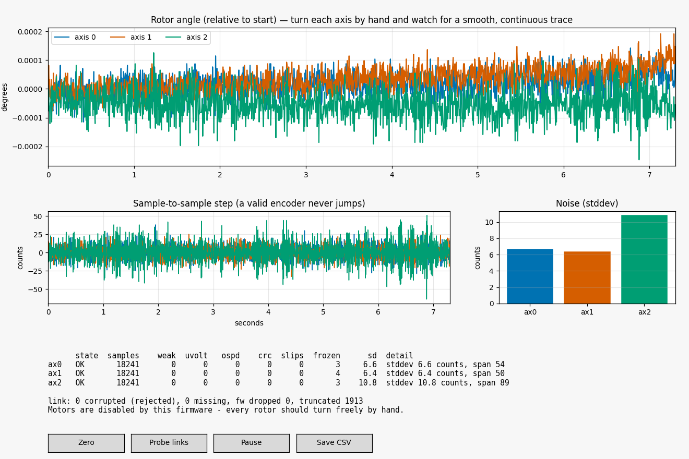

# Encoder Monitor

A read-only tool for answering one question: **are all three encoder readings valid?**

It is a firmware plus a live plotting GUI. The firmware never energizes a motor — it
holds the shared TB6612 enable line low and parks every driver input — so all three
rotors turn freely by hand while you watch the traces.



## Use it

```bash
# once, from firmware/MotionControllerRP/
pio run -e pico_encmon -t upload

# then, from here
pip install -r requirements.txt
python3 encoder_monitor_gui.py
```

Turn each axis by hand. A healthy encoder draws a smooth continuous trace, keeps every
health counter at zero, and shows a standstill noise of well under ~25 counts.

Other modes:

```bash
python3 encoder_monitor_gui.py --port /dev/ttyACM0
python3 encoder_monitor_gui.py --headless 10     # text report, no window, exit 1 on FAIL
python3 encoder_monitor_gui.py --snapshot out.png
python3 encoder_monitor_gui.py --rate 500        # faster position records
```

`--headless` exits non-zero if any axis fails, so it works as a go/no-go check.

## What the window shows

- **Rotor angle** — the live trace per axis, relative to where each started. Turning an
  axis by hand should draw a smooth line with no steps, flat spots or jumps.
- **Sample-to-sample step** — the first difference in raw counts. A valid encoder never
  jumps; a spike here is a dropped or corrupted read.
- **Noise** — standstill standard deviation per axis. This is the number to compare
  *between* axes: a magnet that is too far away, off-centre or the wrong pole reads
  noticeably noisier than its neighbours long before it ever sets the weak-field flag.
- **Health table** — per axis, counted over every internal sample (~37 kHz), not just the
  ones that get streamed, so a glitch between two plotted points is still caught.

| Column | Meaning |
|---|---|
| `weak` / `uvolt` / `ospd` | MT6835 status bits: weak field, undervoltage, overspeed |
| `crc` | reads that failed their CRC |
| `slips` | steps larger than half a turn — the unwrap lost a period |
| `frozen` | longest run of identical reads, i.e. a stuck output |
| `sd` | standstill noise in raw counts |

**Reading the verdict.** A disconnected or unpowered MT6835 leaves MISO floating, which
reads back as all ones — so *every* status bit sets at once. That is why the tool treats
"weak, undervolt and overspeed all set together" as a dead link rather than three
simultaneous physical faults. If two axes report the **identical** number of invalid
reads, one faulty chip is corrupting the shared SPI bus for the other, and the tool says
so.

## Buttons

| Button | Effect |
|---|---|
| Zero | reset the accumulated absolute angles to 0 |
| Probe links | write/read-back the USERID register on all three encoders |
| Pause | freeze the plot (data keeps arriving) |
| Save CSV | dump the plotted window to a timestamped CSV |

## Firmware commands

The firmware also works with a plain serial terminal at 921600 baud: `help`, `start`,
`stop`, `rate <hz>`, `hrate <hz>`, `crc on|off`, `link`, `zero`, `reset`, `info`.

Wire format, one record per line, `#` lines are comments:

```
#CFG,cpr=..,raw_to_rotor_urad=..,gearing=..,axes=..,fw=..
D,<seq>,<t_ms>,<raw0>,<raw1>,<raw2>*<XX>
H,<t_ms>,<axis>,<nsamp>,<weak>,<uvolt>,<ospd>,<crc>,<max_jump>,<slips>,<frozen>,
  <span>,<sd_x100>,<dropped>,<truncated>*<XX>
L,<t_ms>,<ok0>,<ok1>,<ok2>*<XX>
```

## Trusting the link before trusting the data

Every record ends in `*<XX>`, an XOR checksum of everything before the `*`, and every
position record carries a sequence number. This is not ceremony — a single byte lost on
the USB link turns `461402` into `46142`, which parses perfectly and plots as a position
jump indistinguishable from a real encoder fault. That happened during development and
sent the diagnosis down the wrong path.

So the tool separates three different things, and reports them separately:

| Symptom | Meaning |
|---|---|
| **corrupted** | checksum failed — the record was rejected, never plotted |
| **missing** | a gap in the sequence numbers — a record was lost, values still trustworthy |
| **fw dropped** | the firmware skipped a record because the USB buffer was full — harmless |
| **fw truncated** | a partial write — should stay at 0 |

A jump on the plot with all four at zero is a **real encoder event**. `reset` zeroes these
counters so you can measure a fresh window.

The GUI takes the counts-to-degrees scale from the `#CFG` line rather than hardcoding the
geometry, so it stays correct if `hw_config.h` changes.
